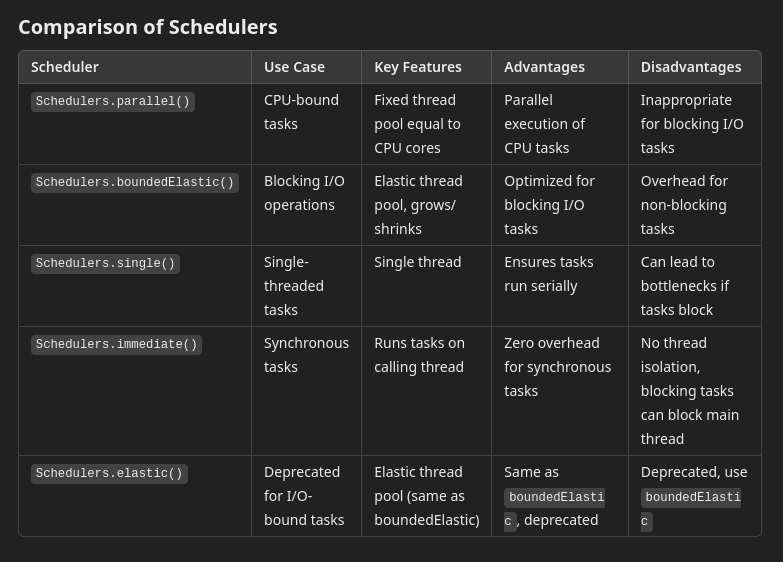

# **Micro-Learning**

This repository serves as a **personal knowledge hub** where I document and organize new concepts, technologies, and skills I learn daily.  
It is a growing library of insights across various domains. By maintaining this repository, I aim to **track my learning progress** and create a **resource for future reference**.

---

# **Index**
1. [Linux Soft Links and Hard Links](#linux-soft-links-and-hard-links)
2. [Reactive Schedulers](#reactive-schedulers)
3. [System Design Interview - Alex Xu - Chapter 1](/SystemDesignInterview-AlexXu.md)
    - [Vertical vs Horizontal Scaling](/SystemDesignInterview-AlexXu.md#vertical-scaling-vs-horizontal-scaling)
    - [Load Balancer](/SystemDesignInterview-AlexXu.md#load-balancer)
    - [Database Replication](/SystemDesignInterview-AlexXu.md#database-replication)
    - [Cache](/SystemDesignInterview-AlexXu.md#cache)
    - [Content Delivery Network](/SystemDesignInterview-AlexXu.md#content-delivery-network-cdn)
    - [Stateful & Stateless architecture](/SystemDesignInterview-AlexXu.md#stateful--stateless-architecture)
    - [Data Centers](/SystemDesignInterview-AlexXu.md#data-centers)
    - [Message queue](/SystemDesignInterview-AlexXu.md#message-queue)
    - [Logging, Metrics, Automation](/SystemDesignInterview-AlexXu.md#logging-metrics-automation)
    - [Database Sharding](/SystemDesignInterview-AlexXu.md#database-sharding)
    - [Designed System](/SystemDesignInterview-AlexXu.md#designed-system---chapter-1)
4. [Java Threads](/JavaThreads.md)

## **Linux Soft Links and Hard Links**

In Linux, **links** are a way to create references to files or directories. There are two types of links:  

### **1. Soft Links (Symbolic Links):**
- These are pointers to the original file or directory.
- They act like shortcuts, and if the original file is deleted, the soft link becomes broken.

### **2. Hard Links:**
- These are direct references to the same data on the disk as the original file.
- Hard links remain functional even if the original file is deleted, as they point to the same **iNode**.

---

### **What is an iNode?**
In Linux and other Unix-like operating systems, an **iNode (index node)** is a data structure used by the filesystem to store **metadata** about a file or directory.  

Each file or directory on a filesystem has an associated iNode that contains:  
- **File Type** (e.g., regular file, directory, etc.)  
- **Permissions** (read, write, execute for owner, group, others)  
- **Owner Information** (User ID and Group ID)  
- **File Size**  
- **Timestamps** (access, modification, and status change times)  
- **Pointer to Data Blocks** (location of file data on disk)  

**Note:** iNodes enable efficient file management and metadata storage. The file name itself is not stored in the iNode but in the directory entry that maps a file name to its iNode.

---

## **Command Examples**

### **Create a Soft Link**
```sh
ln -s <target_file> <link_name>
```

### **Create a Hard Link**

```sh
ln <target_file> <link_name> 
```

## **Soft Linking with Full Paths and Using `$PATH`**

### **1. Create a Soft Link Using Absolute Paths**

To create a symbolic link using absolute paths:

If you have a file `/usr/local/bin/my_script.sh` and want to create a symbolic link in `/home/user/bin/`:

```sh
ln -s /usr/local/bin/my_script.sh /home/user/bin/my_script
```

- `/usr/local/bin/my_script.sh` is the original file (absolute path).
- `/home/user/bin/my_script` is the symbolic link.

Now, you can run `/home/user/bin/my_script` as if it were the original file.

---

### **2. Add the Link to a Directory in `$PATH`**

**To make your script executable from anywhere, Check if the Path is Included**

Ensure `/home/user/bin/` is in your `$PATH`. Check by running:

```sh
echo $PATH
```

**Temporarily Add the Path**

To add `/home/user/bin/` to your `$PATH`
temporarily:

```sh
export PATH=$PATH:/home/user/bin/
```

**Permanently Add the Path**


add it permanently by appending the line to `~/.bashrc` or `~/.bash_profile`:

```sh
echo 'export PATH=$PATH:/home/user/bin/' >> ~/.bashrc
source ~/.bashrc
```

**Create the Symbolic Link**

```sh
ln -s /usr/local/bin/my_script.sh /home/user/bin/my_script
```

Now, you can Run the script from anywhere:
```sh
my_script
```
---

### **3. Soft Link a Directory**

To create a soft link to a directory, for example, linking `/mnt/data/projects` to `/home/user/work`:

```sh
ln -s /mnt/data/projects /home/user/work/projects
```

Now, accessing `/home/user/work/projects` will take you to `/mnt/data/projects`.

---

### **4. Overwrite an Existing Soft Link**

If a symbolic link already exists and you want to replace it:

```sh
ln -sf /new/target/file /path/to/existing/link
```
- -f forces the replacement.
---
### **5. Verify a Symbolic Link**

To confirm a symbolic link's target:

```sh
ls -l /path/to/link
```

Example output:

```sh
lrwxrwxrwx 1 user user 20 Jan 1 12:00 my_script -> /usr/local/bin/my_script.sh
```

With these commands, you can efficiently use soft links for file management and streamline workflows involving executables and `$PATH`.


## **Reactive Schedulers**

In a reactive system like Project Reactor, schedulers control where and on which threads the work is performed. 
Reactive programming models, including Mono and Flux, enable asynchronous and non-blocking behavior. 
Understanding the right scheduler for different tasks is crucial for performance and scalability. Here's a breakdown of the main types of schedulers available in Project Reactor:


### **1. Schedulers.parallel()**
- Computations like complex data processing or algorithmic tasks.
- Example: Processing large data sets, mathematical operations.

```java
Flux.range(1, 1000)
    .publishOn(Schedulers.parallel())
    .map(i -> i * 2)  // CPU-bound operation
    .subscribe(System.out::println);
```

### **2. Schedulers.boundedElastic()**
- I/O operations, such as database access, network calls, file system operations, and blocking external API calls.
- Example: File reads/writes, database queries.

```java
Mono.fromCallable(() -> myBlockingDatabaseCall())  // A blocking call
    .subscribeOn(Schedulers.boundedElastic())  // Offload to boundedElastic scheduler
    .subscribe(result -> System.out.println(result));
```


### **3. Schedulers.single()**
- Tasks that require single-threaded execution or are inherently serial.
- Example: Example: Event-loop style programming or managing shared resources (like writing to a log file in order).

```java
Mono.just("Hello, World")
    .subscribeOn(Schedulers.single())  // Ensure it's processed on a single thread
    .doOnTerminate(() -> System.out.println("Completed"))
    .subscribe(System.out::println);
```


### **4. Schedulers.immediate()**
- For tasks that need to run immediately without additional thread management.
- Example: Very lightweight computations or synchronizing small state updates.

```java
Mono.just("Immediate task")
    .subscribeOn(Schedulers.immediate())  // Run on the current thread immediately
    .doOnTerminate(() -> System.out.println("Completed"))
    .subscribe(System.out::println);
```


### **5. Schedulers.elastic() (Deprecated)**
- Same as `Schedulers.boundedElastic()`, but deprecated and discouraged for new development.




---

## **publishOn vs subscribeOn**

In Project Reactor, both `subscribeOn` and `publishOn` are used to control threading and scheduling, but they differ in when and where they apply the scheduling in the reactive stream.
### **1. subscribeOn**

- Purpose: `subscribeOn` affects where the subscription happens (i.e., where the work starts), and it propagates downstream. This means that the subscription to the stream (the initial part of the flow) will be scheduled on the specified thread or scheduler.

- Impact:
    - It moves the initial work (i.e., the very first operator in the chain) to the thread provided by the scheduler.
    - It affects the entire flow of the stream, ensuring that all operations, including the subscription, are executed on the specified thread.

- Use Case:
        When you want to specify which thread the entire stream of operations should start from (e.g., moving I/O operations or the initial work to a specific thread).

- Example:

    ```java
    Flux.range(1, 1000)
        .subscribeOn(Schedulers.parallel())  // The entire stream starts on parallel scheduler
        .map(i -> i * 2)  // CPU-bound operation
        .subscribe(System.out::println);
    ```

In the above example, the entire stream (including `map` and `subscribe`) will be executed on the parallel scheduler.


### **2. publishOn**

- Purpose: `publishOn` affects where the downstream operations (after `publishOn`) are executed. It doesn't change the thread for the subscription itself but changes the thread for subsequent operators.

- Impact:
    - It moves the execution of operations after publishOn to the specified scheduler.
    - This only affects the downstream operators (operators that come after publishOn).

- Use Case:
    - When you want to change the thread for operations after a certain point in the reactive stream, while the upstream operations might still run on a different thread.

- Example:
    ```java
    Flux.range(1, 1000)
        .publishOn(Schedulers.parallel())  // Switches to parallel scheduler from this point onward
        .map(i -> i * 2)  // CPU-bound operation
        .subscribe(System.out::println);
    ```

In this example:

- The `publishOn` moves the execution of everything after it (i.e., `map`, and `subscribe`) to the `parallel` scheduler.
- The initial subscription (i.e., the `Flux.range(1, 1000)`) is still running on the main thread by default unless specified otherwise.
---
