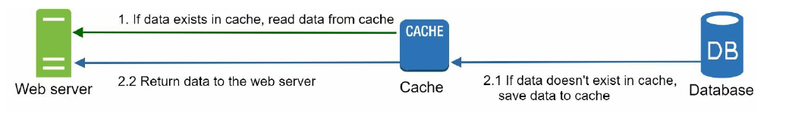
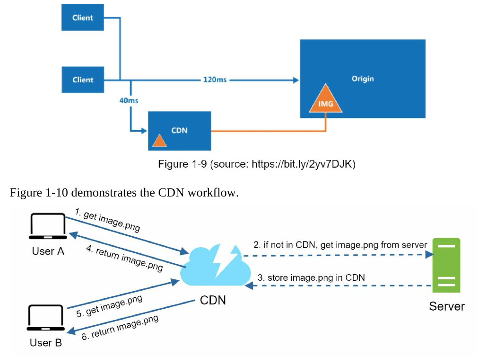
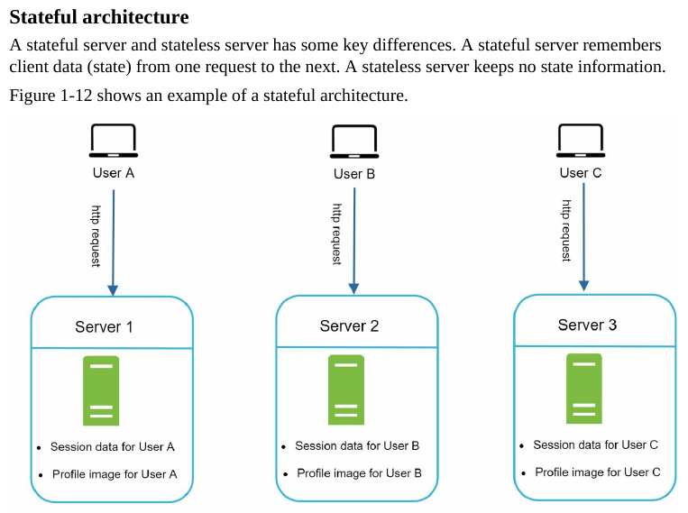
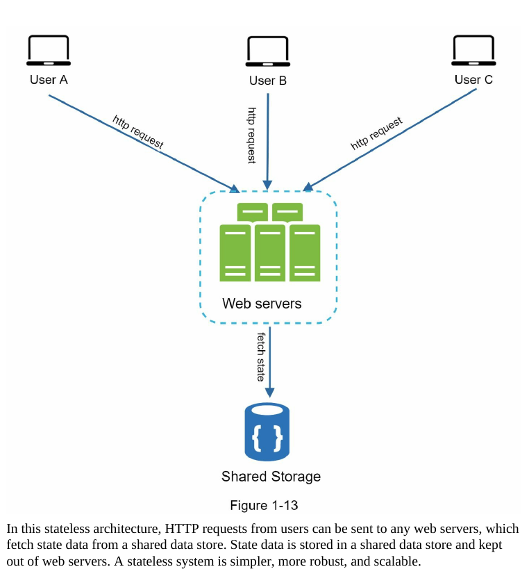
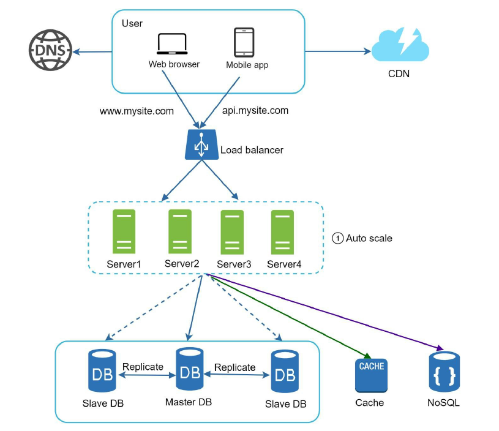
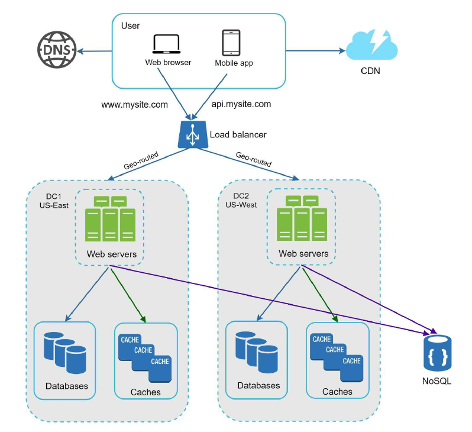
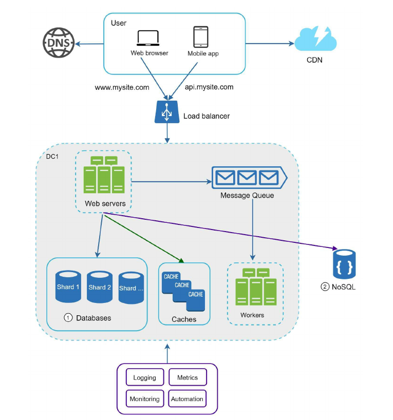

# **System Design Interview - Alex Xu - Chapter 1: Scale from Zero to Millions of Users**

- `Relational databases` are also called a relational database management system (RDBMS) or
SQL database. The most popular ones are MySQL, Oracle database, PostgreSQL, etc.
Relational databases represent and store data in tables and rows. You can perform join
operations using SQL across different database tables.
- `Non-Relational databases` are also called NoSQL databases. Popular ones are CouchDB,
Neo4j, Cassandra, HBase, Amazon DynamoDB, etc. These databases are grouped into
four categories: key-value stores, graph stores, column stores, and document stores. Join
operations are generally not supported in non-relational databases.

For most developers, relational databases are the best option because they have been around
for over 40 years and historically, they have worked well. However, if relational databases
are not suitable for your specific use cases, it is critical to explore beyond relational
databases. Non-relational databases might be the right choice if:
- Your application requires super-low latency.
- Your data are unstructured, or you do not have any relational data.
- You only need to serialize and deserialize data (JSON, XML, YAML, etc.).
- You need to store a massive amount of data.

### **Vertical scaling vs horizontal scaling**
`Vertical scaling`, referred to as `scale up`, means the process of adding more power (CPU,
RAM, etc.) to your servers. `Horizontal scaling`, referred to as `scale-out`, allows you to scale
by adding more servers into your pool of resources.
When traffic is low, vertical scaling is a great option, and the simplicity of vertical scaling is
its main advantage. Unfortunately, it comes with serious limitations.
- Vertical scaling has a hard limit. It is impossible to add unlimited CPU and memory to a
single server.
- Vertical scaling does not have failover and redundancy. If one server goes down, the
website/app goes down with it completely.

Horizontal scaling is more desirable for large scale applications due to the limitations of
vertical scaling.
---

### **Load balancer**
A `load balancer` evenly distributes incoming traffic among web servers that are defined in a
load-balanced set.

users connect to the public IP of the load balancer directly. With this
setup, web servers are unreachable directly by clients anymore. For better security, private
IPs are used for communication between servers. A private IP is an IP address reachable only
between servers in the same network; however, it is unreachable over the internet. The load
balancer communicates with web servers through private IPs.

- If server 1 goes offline, all the traffic will be routed to server 2. This prevents the website
from going offline. We will also add a new healthy web server to the server pool to
balance the load.
- If the website traffic grows rapidly, and two servers are not enough to handle the traffic,
the load balancer can handle this problem gracefully. You only need to add more servers
to the web server pool, and the load balancer automatically starts to send requests to them.

---

### **Database replication**
Quoted from Wikipedia: “Database replication can be used in many database management
systems, usually with a master/slave relationship between the original (master) and the copies
(slaves)”

A master database generally only supports write operations. A slave database gets copies of
the data from the master database and only supports read operations. All the data-modifying
commands like insert, delete, or update must be sent to the master database. Most
applications require a much higher ratio of reads to writes; thus, the number of slave
databases in a system is usually larger than the number of master databases. 

**Advantages of database replication:**
- **Better performance**: In the master-slave model, all writes and updates happen in master
nodes; whereas, read operations are distributed across slave nodes. This model improves
performance because it allows more queries to be processed in parallel.

- **Reliability**: If one of your database servers is destroyed by a natural disaster, such as a
typhoon or an earthquake, data is still preserved. You do not need to worry about data loss
because data is replicated across multiple locations.
- **High availability**: By replicating data across different locations, your website remains in
operation even if a database is offline as you can access data stored in another database
server.

In the previous section, we discussed how a load balancer helped to improve system
availability. We ask the same question here: what if one of the databases goes offline? 

- If only one slave database is available and it goes offline, read operations will be directed
to the master database temporarily. As soon as the issue is found, a new slave database
will replace the old one. In case multiple slave databases are available, read operations are
redirected to other healthy slave databases. A new database server will replace the old one.
- If the master database goes offline, a slave database will be promoted to be the new
master. All the database operations will be temporarily executed on the new master
database. A new slave database will replace the old one for data replication immediately.
In production systems, promoting a new master is more complicated as the data in a slave
database might not be up to date. The missing data needs to be updated by running data
recovery scripts. Although some other replication methods like multi-masters and circular
replication could help, those setups are more complicated; and their discussions are
beyond the scope of this book. 
---

### **Cache**
A cache is a temporary storage area that stores the result of expensive responses or frequently
accessed data in memory so that subsequent requests are served more quickly. Every time a new web page loads, one or more database calls are executed to
fetch data. The application performance is greatly affected by calling the database repeatedly.
The cache can mitigate this problem.

**Considerations for using cache**

Here are a few considerations for using a cache system:
- Decide when to use cache. Consider using cache when data is read frequently but
modified infrequently. Since cached data is stored in volatile memory, a cache server is
not ideal for persisting data. For instance, if a cache server restarts, all the data in memory
is lost. Thus, important data should be saved in persistent data stores.
- Expiration policy. It is a good practice to implement an expiration policy. Once cached
data is expired, it is removed from the cache. When there is no expiration policy, cached
data will be stored in the memory permanently. It is advisable not to make the expiration
date too short as this will cause the system to reload data from the database too frequently.
Meanwhile, it is advisable not to make the expiration date too long as the data can become
stale.
- Consistency: This involves keeping the data store and the cache in sync. Inconsistency
can happen because data-modifying operations on the data store and cache are not in a
single transaction. When scaling across multiple regions, maintaining consistency between
the data store and cache is challenging. For further details, refer to the paper titled
“Scaling Memcache at Facebook” published by Facebook.
- Mitigating failures: A single cache server represents a potential single point of failure
(**SPOF**), defined in Wikipedia as follows: “A single point of failure (SPOF) is a part of a
system that, if it fails, will stop the entire system from working”. As a result, multiple
cache servers across different data centers are recommended to avoid SPOF. Another
recommended approach is to overprovision the required memory by certain percentages.
This provides a buffer as the memory usage increases.
- Eviction Policy: Once the cache is full, any requests to add items to the cache might
cause existing items to be removed. This is called cache eviction. Least-recently-used
(**LRU**) is the most popular cache eviction policy. Other eviction policies, such as the Least
Frequently Used (**LFU**) or First in First Out (**FIFO**), can be adopted to satisfy different use
cases.

---

### **Content delivery network (CDN)**
A `CDN` is a network of geographically dispersed servers used to deliver static content. CDN
servers cache static content like images, videos, CSS, JavaScript files, etc.
Dynamic content caching is a relatively new concept and beyond the scope of this book. It
enables the caching of HTML pages that are based on request path, query strings, cookies,
and request headers. Refer to the article mentioned in reference material for more about
this. This book focuses on how to use CDN to cache static content.

**Here is how CDN works at the high-level:** when a user visits a website, a CDN server closest
to the user will deliver static content. Intuitively, the further users are from CDN servers, the
slower the website loads. For example, if CDN servers are in San Francisco, users in Los
Angeles will get content faster than users in Europe.

---

### **Stateful & Stateless architecture**
A stateful server and stateless server has some key differences. A stateful server remembers
client data (state) from one request to the next. A stateless server keeps no state information.

**Stateful**

**Stateless**

**Stateless system**

---

### **Data centers**
In normal operation, users are
geoDNS-routed, also known as geo-routed, to the closest data center, with a split traffic of
x% in US-East and (100 – x)% in US-West. geoDNS is a DNS service that allows domain
names to be resolved to IP addresses based on the location of a user.

---

### **Message queue**
A message queue is a durable component, stored in memory, that supports asynchronous
communication. It serves as a buffer and distributes asynchronous requests. The basic
architecture of a message queue is simple. Input services, called producers/publishers, create
messages, and publish them to a message queue. Other services or servers, called
consumers/subscribers, connect to the queue, and perform actions defined by the messages.

---
### **Logging, metrics, automation**
When working with a small website that runs on a few servers, logging, metrics, and
automation support are good practices but not a necessity. However, now that your site has
grown to serve a large business, investing in those tools is essential.

- **Logging**: Monitoring error logs is important because it helps to identify errors and problems
in the system. You can monitor error logs at per server level or use tools to aggregate them to
a centralized service for easy search and viewing.
- **Metrics**: Collecting different types of metrics help us to gain business insights and understand
the health status of the system. Some of the following metrics are useful:
    - Host level metrics: CPU, Memory, disk I/O, etc.
    - Aggregated level metrics: for example, the performance of the entire database tier, cache
tier, etc.
    - Key business metrics: daily active users, retention, revenue, etc.
- **Automation**: When a system gets big and complex, we need to build or leverage automation
tools to improve productivity. Continuous integration is a good practice, in which each code
check-in is verified through automation, allowing teams to detect problems early. Besides,
automating your build, test, deploy process, etc. could improve developer productivity
significantly.

--- 

### **Database Sharding**

**Horizontal scaling**, also known as **sharding**, is the practice of adding more servers.
Sharding separates large databases into smaller, more easily managed parts called shards.
Each shard shares the same schema, though the actual data on each shard is unique to the
shard.
User data is allocated to a database server based on user IDs. Anytime you access data, a hash function is used to find the
corresponding shard. In our example, `user_id % 4` is used as the hash function. If the result
equals to 0, shard 0 is used to store and fetch data. If the result equals to 1, shard 1 is used.
The same logic applies to other shards.

Sharding is a great technique to scale the database but it is far from a perfect solution. It
introduces complexities and new challenges to the system:

- **Resharding data**: Resharding data is needed when 1) a single shard could no longer hold
more data due to rapid growth. 2) Certain shards might experience shard exhaustion faster
than others due to uneven data distribution. When shard exhaustion happens, it requires
updating the sharding function and moving data around. Consistent hashing, which will be
discussed in Chapter 5, is a commonly used technique to solve this problem.

- **Celebrity problem**: This is also called a hotspot key problem. Excessive access to a specific
shard could cause server overload. Imagine data for Katy Perry, Justin Bieber, and Lady
Gaga all end up on the same shard. For social applications, that shard will be overwhelmed
with read operations. To solve this problem, we may need to allocate a shard for each
celebrity. Each shard might even require further partition.
- **Join and de-normalization**: Once a database has been sharded across multiple servers, it is
hard to perform join operations across database shards. A common workaround is to de-
normalize the database so that queries can be performed in a single table.
---

### **Designed System - Chapter 1**

---

### **Millions of users and beyond**
Scaling a system is an iterative process. Iterating on what we have learned in this chapter
could get us far. More fine-tuning and new strategies are needed to scale beyond millions of
users. For example, you might need to optimize your system and decouple the system to even
smaller services. All the techniques learned in this chapter should provide a good foundation
to tackle new challenges. To conclude this chapter, we provide a summary of how we scale
our system to support millions of users:

- Keep web tier stateless
- Build redundancy at every tier
- Cache data as much as you can
- Support multiple data centers
- Host static assets in CDN
- Scale your data tier by sharding
- Split tiers into individual services
- Monitor your system and use automation tools

---

# **System Design Interview - Alex Xu - Chapter 2: BACK-OF-THE-ENVELOPE ESTIMATION**

According to Jeff Dean,
Google Senior Fellow, “back-of-the-envelope calculations are estimates you create using a
combination of thought experiments and common performance numbers to get a good feel for
which designs will meet your requirements” 

The following concepts should be well understood: power of two,
latency numbers every programmer should know, and availability numbers.

**Power of Two**

**Latency Numbers**

**Dr. Dean's Numbers**

By analyzing the numbers in Figure 2-1, we get the following conclusions:

- Memory is fast but the disk is slow.
- Avoid disk seeks if possible.
- Simple compression algorithms are fast.
- Compress data before sending it over the internet if possible.
- Data centers are usually in different regions, and it takes time to send data between them.

**Availability Numbers** 

**Example: Estimate Twitter QPS and storage requirements**
Please note the following numbers are for this exercise only as they are not real numbers
from Twitter.
**Assumptions:**
- 300 million monthly active users.
- 50% of users use Twitter daily.
- Users post 2 tweets per day on average.
- 10% of tweets contain media.
- Data is stored for 5 years.

**Estimations:**
Query per second (QPS) estimate:
- Daily active users (DAU) = 300 million * 50% = 150 million
- Tweets QPS = 150 million * 2 tweets / 24 hour / 3600 seconds = ~3500
- Peek QPS = 2 * QPS = ~7000

We will only estimate media storage here.

Average tweet size:
- tweet_id: 64 bytes
- text: 140 bytes
- media: 1 MB
- Media storage: 150 million * 2 * 10% * 1 MB = 30 TB per day
- 5-year media storage: 30 TB * 365 * 5 = ~55 PB

